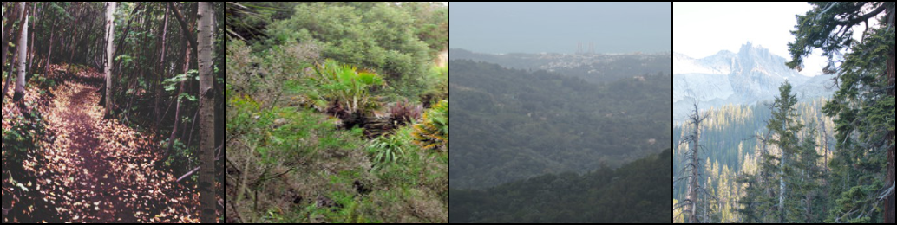
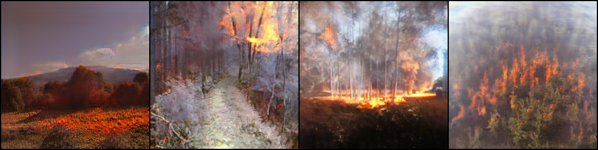
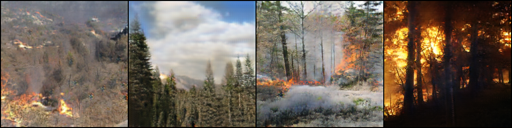
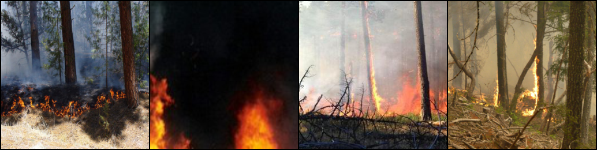

# Intel Hackathon CycleGAN Project

## Project App
To run the project app, type in the command line \
`bash run_server.sh` \
and wait untill the browser will be opened.

## Requirements

* [Python3](https://www.python.org/)
* [PyTorch](https://pytorch.org/)
* [Flask](https://pypi.org/project/Flask/)
* [NodeJS](https://nodejs.org/en/)	
* [Angular](https://angular.io/)

### Notes

Cuda is required for training, but CPU is enough for the project App to run (inference time).

### Results

#### Gifs with the project app

#### Images - 4 real images followed by 4 fake images generated by our models on diffrent training time.

##### Made by 
- Dawid Majchrowski (Lead)
- Emil Markiewicz
- Arkadiusz Zema
- Kamil Opalach
- Paweł Renc
- Vitaily Mysak